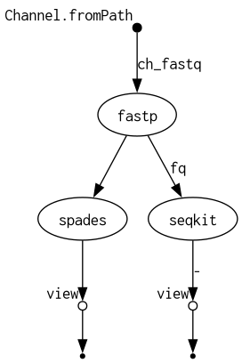

# BIOL-7210: Nextflow Genomics Workflow

## Data for Testing
Test data is included in this repository:
- **data/test.fastq.gz**: first mate from SRA accession **SRR1205095**, subsampled to 1,000 reads (≈4,000 lines).

## Requirements
- **Nextflow:** v24.10.5  
- **Package Manager:** Conda (Miniconda/Anaconda) — environment name `nf_env` with bioconda packages  
- **Operating System:** Ubuntu 20.04 (or any Linux distro)  
- **Architecture:** x86_64  

## Workflow Diagram


## Quick Test
Once your environment is set up, just run these three commands to execute the entire pipeline in under 30 minutes:

```bash
conda create -n nf_env -c bioconda nextflow fastp spades seqkit -y
conda activate nf_env
nextflow run main.nf -profile conda
